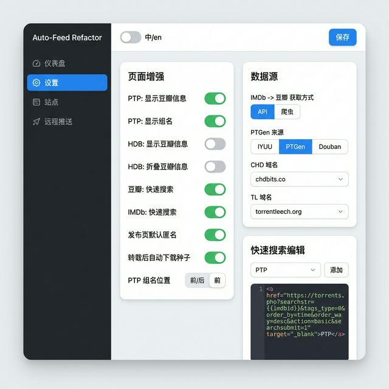
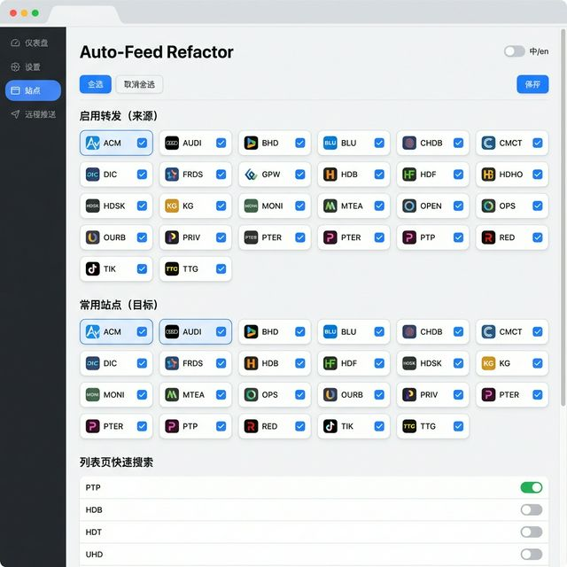
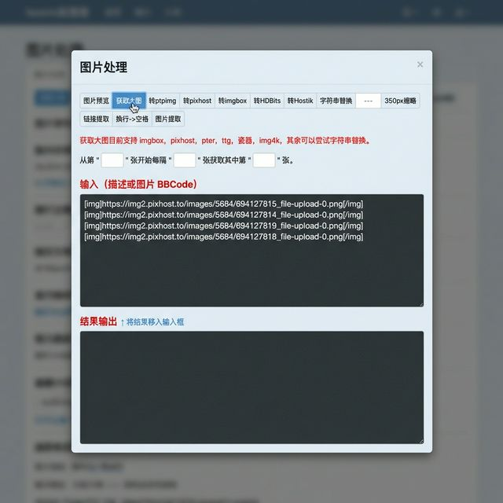

# Auto-Feed Refactor

原作者：**tomorrow505**  
当前维护：**gawain**

仓库地址：<https://github.com/Gawain12/auto_feed_js>

这是一个面向 PT 转载场景的重构版脚本，目标是在保留原版核心体验的基础上，提供更清晰的站点适配结构与更稳定的转发流程。

## 当前进度（2026-02-12）
- 非音乐站点主链路（解析 -> 缓存 -> 预填）已基本稳定。
- 音乐站点（RED / OPS / DIC / OpenCD）已接入，但仍在持续完善。
- 详细状态见：[`docs/wiki/FEATURE_PARITY.md`](docs/wiki/FEATURE_PARITY.md)

## 核心功能
- 源站详情页一键转发到目标站上传页
- 自动预填标题、简介、媒体信息、图片等字段
- IMDb -> 豆瓣 / PTGen 信息补全
- 页面增强（PTP/HDB 等）与快速搜索入口
- 图片转存与图床桥接（PTPIMG/PIXhost/Freeimage/Gifyu/Hostik 等）
- 远程推送（qBittorrent / Transmission / Deluge）
- 种子清洗（Source/Announce/date/comment 等处理）

## 界面截图

### 设置面板


### 站点选择


### 图片处理工具


## 功能预览

### 站点配置


设置转发来源、常用目标站点、列表页快速搜索开关。其他嵌入模式 / 快速查询保持一致。

### 设置面板


页面增强、数据源选择、快速搜索模板编辑等。

### 图片处理


多图床转存（PTPIMG / Pixhost / Imgbox / HDBits / Hostik）、获取大图、缩略图、链接提取。

## 安装（Release）
1. 安装 Tampermonkey。
2. 安装脚本：
   - Dev（随 `refactor-dev` 分支自动更新）  
     <https://github.com/Gawain12/auto_feed_js/releases/download/dev/auto_feed.user.js>
   - Stable（打 Tag `v*` 后）  
     <https://github.com/Gawain12/auto_feed_js/releases/latest/download/auto_feed.user.js>

## 使用引导
1. 打开支持站点的种子详情页。
2. 点击标题附近的 `转发/Reupload`。
3. 需要补信息时点击 `点击获取`。
4. 选择目标站跳转上传页，脚本自动预填。
5. 按 `Alt + S` 打开设置面板。

## 本地开发
环境：
- Node.js 18.20.x+
- npm 10+

命令：
```bash
npm install
npm run dev
npm run build
```

本地安装入口：
- `http://127.0.0.1:5174/auto-feed.user.js`

后台常驻（screen）：
```bash
npm run dev:screen
npm run dev:screen:attach
npm run dev:screen:stop
```

## 项目结构
- `src/trackers/`：站点级 parse/fill（TTG、PTP、HDB、GPW、RED、OPS、OpenCD 等）
- `src/templates/`：框架级模板（NexusPHP、Unit3D、Unit3DClassic）
- `src/common/rules/`：通用纯规则（标题重建、分组名、字段规整）
- `src/services/`：运行时服务（嵌入、增强、图床、远程推送、设置/存储）
- `docs/wiki/`：使用文档、功能对照、开发说明

## 文档导航
- Wiki 首页：[`docs/wiki/Home.md`](docs/wiki/Home.md)
- 使用教程：[`docs/wiki/Usage.md`](docs/wiki/Usage.md)
- 设置说明：[`docs/wiki/Settings.md`](docs/wiki/Settings.md)
- 功能对照：[`docs/wiki/FEATURE_PARITY.md`](docs/wiki/FEATURE_PARITY.md)
- 站点支持：[`docs/wiki/Site-Support.md`](docs/wiki/Site-Support.md)

## License
GPL-3.0
